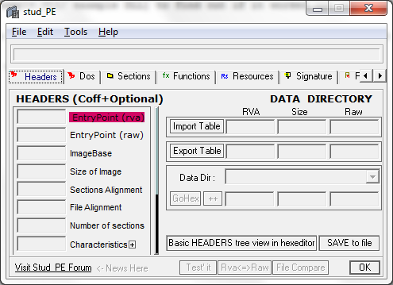

# DLL Import

Since it took me a while to figure out how to add a DLL to the Ragexe or Ragexe_RE client, I will explain it now in under 5 minutes.

At first we need 2 things to get it working.

1. [Stud PE](http://www.cgsoftlabs.ro/zip/Stud_PE.zip), which we need to import the DLL.
2. An [example DLL](http://www.xup.in/dl,10633471/example.dll/) to find out if it worked out well.

When you finished downloading these two files, extract the setup from the Stud_PE.zip and install it to your computer.

After you installed it and started it, there should be a window popping up, which look like this:

Then click on File in the top menu and then on Open PE File. Then there will show up a File Open Dialog where you choose your RagnarokExe.

After that the PE File gets loaded and you switch to the Function Tab in the Program, like here:

There you see all DLL's which get actually loaded and what functions exactly get loaded.

In Order to add our own DLL to the list of the DLL's which get loaded, rightclick into the window where the DLL Files are listed and choose "Add New Import".
A new windows is opening which looks like this:

There you choose your own DLL with the File Open Dialog which you open with "DLL Select" and then you choose the function which should get loaded.
A DLL has a startup routin which we load from our example.dll which you downloaded before. It looks like this:

And if you choose the DllMain@12, it has a blue background and then click on Ok.
Your Import Adder should look like this:

Then click on "ADD" and it's done, your Client.exe loads the DLL from now on.

Just close the program, move the dll to your client's folder and start the client.
Then there should be a MessageBox when your Client starts, which looks like this.

Congratulations, you added a DLL to your Client.
